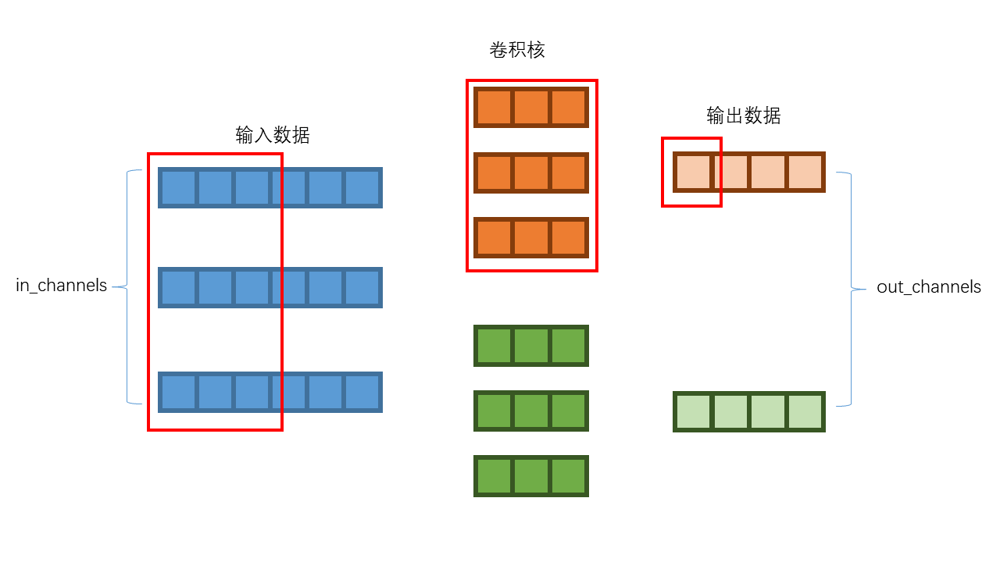
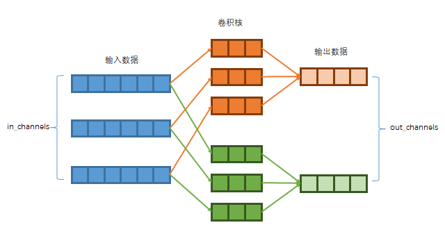
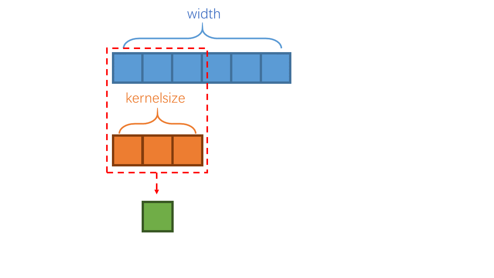
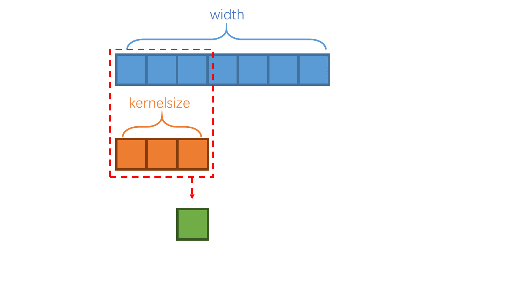
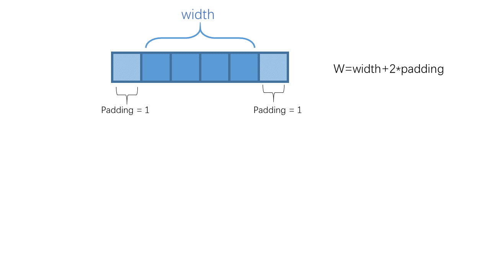
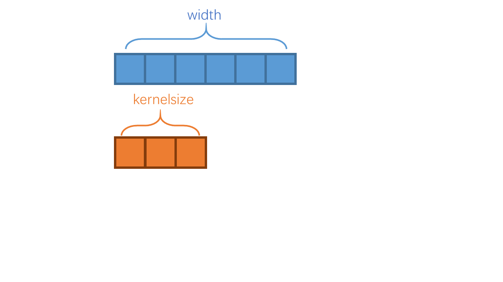

**卷积层运算介绍**

本文简单介绍卷积作用方式以及数据尺寸变化，如果您了解卷积计算流程，只是想要知道数据尺寸如何变化，（或者卷积层如何变化，可保持数据尺寸不变），可直接跳到带序号的公式部分。

#### 1 卷积作用方式

##### 1.1 总述

卷积层是深度学习模型中一个常见结构，按维度常见的有1维卷积、2维卷积。分别对应处理1维数据（一般为信号）和2维数据（一般为图像）。

卷积层使用卷积核进行卷积运算，可将数据通道数由in_channels变化为out_channels，同时改变原输入数据的尺寸（1维为width，二维为height，width）。

卷积运算方式为：



其中红框部分的输入数据与卷积核尺寸相同，两者所有位置对应相乘，再将所有位置的乘积求和，可得输出数据中的红框部分。

卷积计算可认为是依次将输入数据的一部分与卷积核，对应相乘后求和的操作。

- 二维同理 ，只不过输入数据和卷积核的尺寸从一维为了二维 。
- 卷积核相当于对某类输入数据片段敏感的滤波器。卷积核训练过程中随着梯度反向传播不断更新，最终可获得能提取训练数据特征的的卷积核。

##### 1.2 改变通道数

以一维数据一维卷积为例，对单个样本：



卷积核有out_channels组，每一组的通道数与输入数据通道数in_channels相同，用于与输入数据进行卷积计算，计算后就得到输出数据的一个通道。因此out_channels组卷积全部计算完后，输出数据的通道为out_channels。

- 二维同理 ，只不过数据从一维的长度变为了二维。

##### 1.3 改变数据尺寸

仍以一维数据一维卷积为例，但为展示数据尺寸变化，将输入输出数据通道数设为1，对单个样本：



上述的卷积方式是最常见的，最终输出数据尺寸 $ width' = width-kernelsize + 1 $.

width'：输出数据尺寸。width：输入数据尺寸。kernelsize：卷积核尺寸

```python
import torch
import torch.nn as nn
x = torch.randn(1,3,100) #输入数据 (bs,in_channels,width)
conv = nn.Conv1d(in_channels=3,out_channels=2,kernel_size=4) #一维卷积
x_ = conv(x) #输出数据 (bs,out_channels,width')

print(x.shape,'->',conv(x).shape)  #通道和尺寸变化
#torch.Size([1, 3, 100]) -> torch.Size([1, 2, 97])
print(conv.weight.shape) #卷积核尺寸 (out_channels,in_channels,kernel_size)
#torch.Size([2, 3, 4])
```

#### 2 卷积、反卷积尺寸变化公式

##### 2.1 卷积尺寸变化

pytorch定义卷积时有多个参数

```python
conv = nn.Conv1d(in_channels = 3,  #输入通道数
                 out_channels= 5,  #输出通道数
                 kernel_size = 3,  #卷积核尺寸
                 padding = 2,      #填充
                 dilation = 2,     #膨胀
                 stride = 2,       #跳步
                 )
```

输出数据尺寸为 $ width'=(W-K)//stride + 1 $.

- stride：卷积计算滑动时，每次滑动的步长，相当于跳过了部分卷积运算。

  //表示地板除法，即除法后结果向下取整，舍去小数（余数）。



- W：进行卷积运算数据的实际尺寸，有 $ W=width +2*padding $.

  padding：在原始数据两侧各填充长度为padding的数据，相当于增加了卷积运算数据的尺寸。



- K：卷积核的实际尺寸，有 $K= dilation*(kernelsize-1) +1 $.

  dilation：对卷积核内部每两个值之间填充长度为dilation-1的数据，相当于增加了卷积核的尺寸。



综上最终输出输出数据尺寸：


$$
width' = [width+2*padding-(dilation*(kernelsize-1) +1)]//stride + 1 \quad\quad      (1)
$$

```python
import torch

width = 100
in_channels = 3
out_channels= 4
kernel_size = 5
padding = 6
dilation = 7
stride = 2

x = torch.randn(1,in_channels,width) #输入数据
conv = nn.Conv1d(in_channels, out_channels, kernel_size, stride, padding, dilation)
x_ = conv(x) #输出数据

#按公式(1）计算的输出数据尺寸
print( (width + 2*padding - (dilation*(kernel_size-1)+1))//stride + 1 ) #42
#实际输出的数据尺寸
print(x_.shape[-1]) #42
```

- 二维数据的情况是上述参数也是二维的，对应宽度和高度两个维度，但每个维度上的尺寸变化同一维，不再叙述。

##### 2.2 卷积保持数据尺寸不变

stride=1时，想保证输出数据尺寸不变，可令尺寸公式(1)  $ width' = width $，求得

$$
padding = dilation*(kernelsize-1)/2 \quad\quad (2)
$$

注意，pytorch中的padding是输入数据前后两端都填充padding位。

所以如果  $ dilation*( kernelsize-1) $ 是奇数例如3，相当于输入数据总共要补3位，求出的padding为1.5。而padding必须是整数：如果padding取1，共补2位不够；如果padding取2，共补4位，输出数据尺寸将多出1位。

这种情况要么除法结果向上取整，卷积运算后对输出数据进行截取，舍弃最后1位。要么用其他方法在卷积前先完成首尾共计 $ dilation*(kernelsize-1) $  位的填充，然后卷积层时不再进行填充。要么使用偶数的dilation或者奇数的kernelsize，可保证  $ dilation*( kernelsize-1) $ 是偶数。

```python
import torch
import math

width = 100
in_channels = 3
out_channels= 4
kernel_size = 5
dilation = 6
stride = 1

#按公式(2)求取padding，向上取整
padding = math.ceil(dilation*(kernel_size-1)/2)
print(padding) #12

x = torch.randn(1,in_channels,width) #输入数据
conv = nn.Conv1d(in_channels, out_channels, kernel_size, stride, padding, dilation)
x_ = conv(x)#输出数据

#输入数据尺寸
print(width) #100
#实际输出的数据尺寸
print(x_.shape[-1]) #100
```

##### 2.3 卷积使数据尺寸成倍减少

stride>1时，想让数据尺寸成倍数变化，即让输出数据尺寸变为输入数据的1/stride倍，可令公式 (1)  $ width'=width/stride $ （需width可被设定的stride整除），求得

$$
-2*padding + dilation*kernelsize - dilation +1 = stride +Res\\
padding  =  (dilation*kernelsize- dilation -stride +1-Res)/2
$$

因为原公式中有地板除法，因此存在Res项，Res可取0,1,...,stride-1中任意一个，其在地板除后会被舍去，不影响地板除法的结果。（例如 x//3=1 可推出 x=3+Res，Res可取0，1，2）

由于Res可以有多种取法，上式可调整Res让2*padding是偶数，从而使padding为整数。可直接如下设置（分子在Res取0不能被2整除时，Res取1即可让分子变为偶数，而stride>1时，Res一定能取到1，Res取1就相当于将除2结果向下取整）。

$$
padding  =  (dilation*kernelsize- dilation -stride +1)//2 \quad\quad (3)
$$

```python
import torch
import math

width = 100
in_channels = 3
out_channels= 4
kernel_size = 7
dilation = 6
stride = 5 #数据尺寸变为1/5

#按公式(3)求取padding，向上取整
padding = (dilation*kernel_size- dilation -stride +1)//2
print(padding) #16

x = torch.randn(1,in_channels,width) #输入数据
conv = nn.Conv1d(in_channels, out_channels, kernel_size, stride, padding, dilation)
x_ = conv(x)#输出数据

#输出尺寸目标为
print(width/stride) #20.0
#实际输出的数据尺寸
print(x_.shape[-1]) #20
```

##### 2.4 反卷积尺寸变化

反卷积并不是卷积的反向操作，但其可以将数据尺寸由卷积后还原到卷积前。其本质上还是在进行（先转置的）卷积操作。

其可将输入数据进行进行类似卷积核膨胀dilation的操作再卷积，因此表现为反卷积后，输出数据的尺寸大于输入。

其参数与卷积层类似

```python
deconv = nn.ConvTranspose1d(in_channels = 3,   #输入通道数
                           out_channels= 5,   #输出通道数
                           kernel_size = 3,   #卷积核尺寸
                           padding = 2,       #填充
                           dilation = 2,      #膨胀
                           stride = 2,        #跳步
                           output_padding = 1,#输出填充
                           )
```


定义输入数据尺寸width，由于反卷积仍是卷积操作，其输出数据尺寸  $ width'=W-K + 1 +outputpadding $.

- outputpadding：将反卷积后得到的输出数据仅在末端填充数据的尺寸，相当于增加了输出数据的尺寸。

- K：卷积核的实际尺寸，有 $K= dilation*(kernelsize-1) +1 $.

  dilation：对卷积核内部每两个值之间填充长度为dilation-1的数据，相当于增加了卷积核的尺寸。

  同2.1中对卷积核的dilation

- W：进行反卷积运算，输入数据的实际尺寸，有 $ W=stride*(width-1)+1+2*P $.

  stride：对输入数据内部每两个值之间填充长度为stride-1的数据，相当于增加了运算数据的尺寸。

  对输入数据进行类似2.1中卷积核dilation的操作。

- P：在输入数据两侧各填充长度为P的数据，相当于增加了运算数据的尺寸。有 $ P = dilation *(kernelsize-1)-padding $ .

  注意，反卷积的padding实际上和卷积层的padding相反，值越大，填充的数据越少。

  对输入数据进行类似2.1中padding的操作，但这里两端填充的数据长度不是padding而是P。

最终反卷积输出尺寸和参数关系公式为

$$
width'=stride*(width-1)-2*padding+dilation *(kernelsize-1) + 1 +outputpadding \quad\quad (4)
$$

```python
import torch

width = 100
in_channels = 2
out_channels= 3
kernel_size = 4
padding = 5
dilation = 6
stride = 7
output_padding = 1

x = torch.randn(1,in_channels,width) #输入数据
deconv = nn.ConvTranspose1d(in_channels, out_channels, kernel_size, stride, padding, dilation = dilation, output_padding=output_padding)
x_ = deconv(x) #输出数据

#按公式(4）计算的输出数据尺寸
print( stride*(width-1)-2*padding+dilation *(kernel_size-1) + 1 +output_padding ) #703
#实际输出的数据尺寸
print(x_.shape[-1]) #703
```

##### 2.5 反卷积与卷积的尺寸变化关联

其有一个简单记法，将公式(1)卷积中width'与width对调，求width有

$$
width = [width'+2*padding-(dilation*(kernelsize-1) +1)]//stride + 1 \\
width' = stride*(width-1)-2*padding+dilation *(kernelsize-1) + 1 +Res
$$

因为原公式中有地板除法，因此存在Res项，Res可能是0,1,...,stride-1中任意一个（例如 x//3=1 可推出 x=3+Res，Res可能是0，1，2 中的任意一个）

上式与(4)一致，说明反卷积的输出尺寸，等于同参数卷积层的输入尺寸。（或者说同参数的卷积层和反卷积层，输入输出数据尺寸是互换的）。由于卷积中存在地板除法，因此多个输入对应一个输出，由输出尺寸反推输入尺寸时，余数Res部分无法推算还原，因此采用outputpadding参数补齐。

```python
import torch

width = 100
in_channels = 2
out_channels= 3
kernel_size = 4
padding = 4
dilation = 3
stride = 2
output_padding = 0

conv = nn.Conv1d(in_channels, out_channels, kernel_size, stride, padding, dilation)#卷积层
deconv = nn.ConvTranspose1d(out_channels, in_channels, kernel_size, stride, padding, dilation = dilation, output_padding=output_padding)#同参数反卷积层

x = torch.randn(1,in_channels,width) #卷积层输入数据
x_ = conv(x) #卷积层输出数据（反卷积层输入数据）
x__ = deconv(x_) #反卷积层输出数据

#卷积层输入尺寸
print(x.shape[-1]) #100
#反卷积层的输出尺寸（与卷积层输入尺寸一致）
print(x__.shape[-1]) #100 #如果不一致，相差必定小于stride，通过设置outputpadding，差多少设置多少补齐
```

##### 2.6 反卷积使数据尺寸成倍增加

stride>1时，想让数据尺寸成倍数变化，即让输出数据尺寸变为输入数据的stride倍，可令公式 (4)  $ width'=width*stride $ ，求得

$$
outputpadding = 2*padding+stride-dilation *(kernelsize-1) - 1  \quad\quad (5)
$$

```python
import torch

width = 100
in_channels = 2
out_channels= 3
stride = 5 #数据尺寸变为5倍
kernel_size = 4
dilation = 1
padding = 1
#按公式(5)设置outputpadding
output_padding = 2*padding + stride - dilation *(kernel_size-1) - 1

x = torch.randn(1,in_channels,width) #输入数据
deconv = nn.ConvTranspose1d(in_channels, out_channels, kernel_size, stride, padding, dilation = dilation, output_padding=output_padding)
x_ = deconv(x) #输出数据

#输入数据尺寸
print(x.shape[-1]) #100
#输出数据尺寸
print(x_.shape[-1]) #500
```


