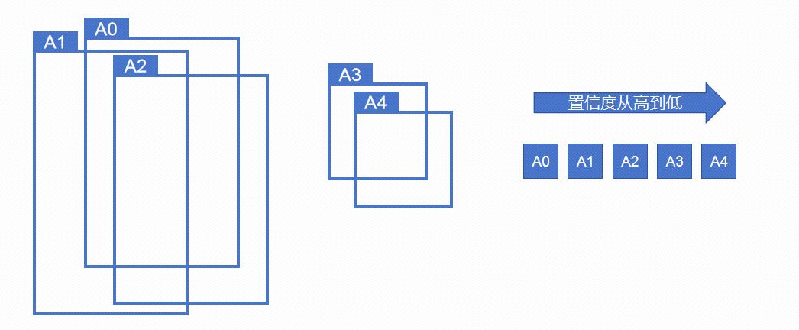
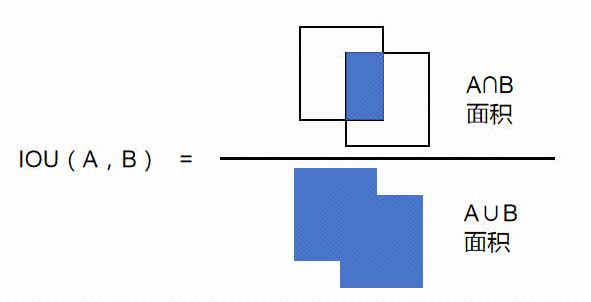
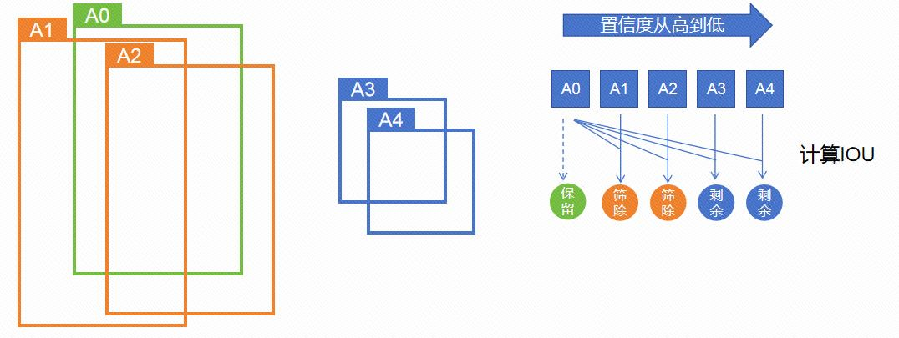
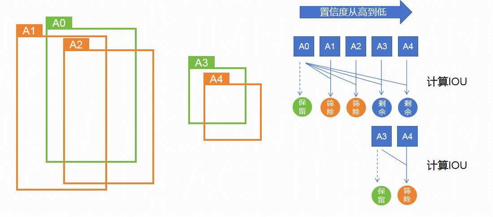

**NMS 非极大值抑制简介**

该算法基本和目标检测绑定了，当目标检测算法得到多个候选框后，我们使用NMS对其进行筛选。

nms的思路就是字面的意思，非极大值就对其抑制。

##### 1.保留

目标检测对同一类物体A，可能产生了多个候选框A0,A1,....,

每个候选框会有一个置信度（一般理解为该框内有该类物体A的概率），值越高就说明这个框越值得相信。

假设本例中共5个框，置信度从高到低依次是A0,A1,A2,A3,A4

现在框太多，而且很多框大小位置很接近，我们想要筛选一下，只保留少数几个。

首先当然应该选择保留置信度最高的框A0，它是目前最值得信任的（极大值）。

##### 2.筛除

那么接下来就要对非极大值（A1,A2,...）进行抑制。

A1虽然是置信度第二高的，但并不代表它能保留下来。A1能保留与否，取决于它与A0的交并比（IOU，两个框交集和并集的面积比，可粗略理解为两个框的重合程度，两个框的位置差别）。

我们会预设一个阈值，只有当A1与A0交并比足够小，小于阈值，也就是两个框位置大小差异足够大，才能避免筛除。后续A2，A3等也是如此，与A0求交并比，当交并比大于阈值时筛除。

*此处思路是，既然A0是置信度最高，最值得信任的，那么其他的框置信度高不高反倒是其次（反正也不会有A0高），和A0接不接近才是关键。因为如果和A0比较接近，我们会选择直接相信A0，保留A0框即可，没有必要保留与A0相近而又置信度不够的框。*

经过筛选A1，A2因为和A0差别较小，（基本意味着和A0所框的是同一个物体），被筛除。而A3，A4虽然置信度低，但和A0差别大，（有可能框住的是该类的其他物体），暂时不筛除，剩余下来。

##### 3.迭代

但这没有结束，这只是进行了1轮，我们保留了极大值A0，筛除了A1，A2，剩余了A3，A4。

目前A3成为了遗留候选框中的置信度最大者，A3成为了新的极大值（此时A3就相当于上一轮中的A0）。

此时保留A3，计算A3之后的所有框（本例中为A4）和A3的交并比，进行筛除。

整个流程结束的标志是，除了作为极大值被保留的框，和 非极大值且与极大值的框接近而被筛除的框，已经没有剩余候选框的时候。

假设上例A3和A4交并比大于阈值，A4会被筛除，那么极大值A3保留，A4筛除，已经没有剩余候选框了。

流程结束，最终A0-A4五个框，保留的框为A0和A3。

需要注意的点是，非极大值抑制的流程是针对同类物体的候选框，例如上例中A0-A4都是A物体的候选框。如果还有B物体的候选框B0-B3，那么上述NMS流程会进行2次，A框和B框分开进行。

不可把两类物体的候选框混在一起进行，也就是用A去抑制B（或相反），B类物体的候选框筛除与否，不应由A类候选框决定。即使某个A框和B框接近，它们只是位置大小相近，而它们识别的是不同物体，筛除会导致某类物体的漏判。

